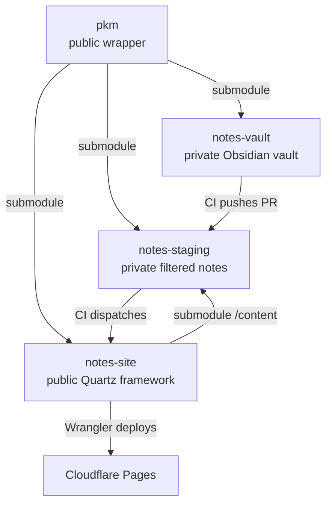
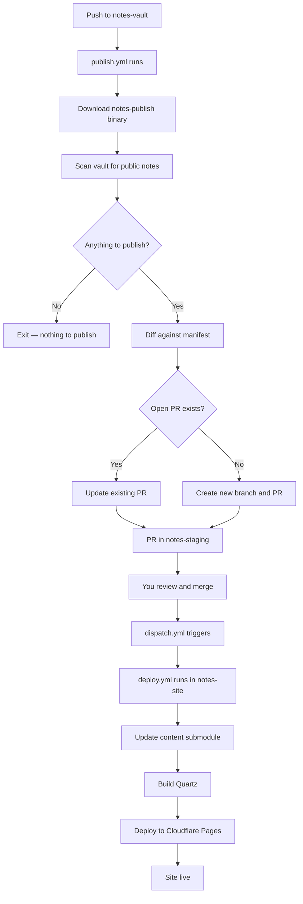
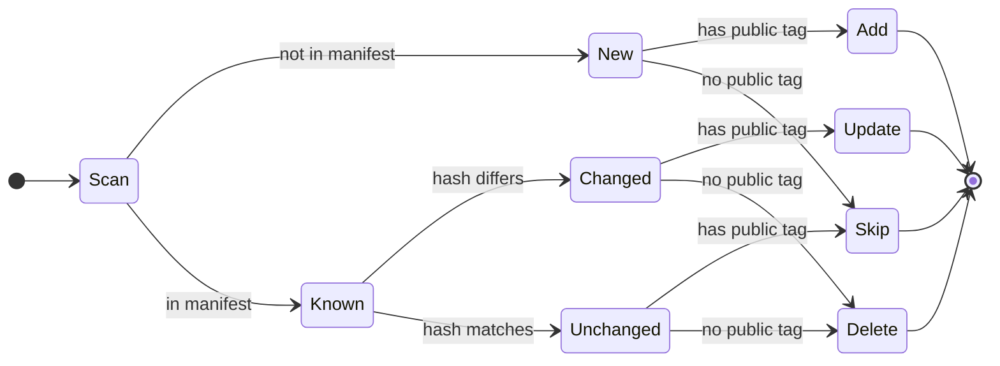
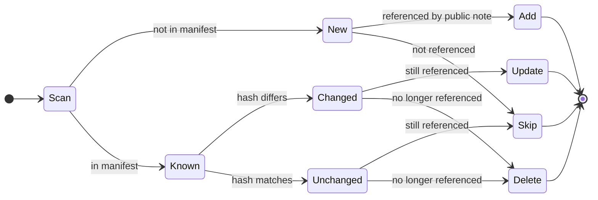
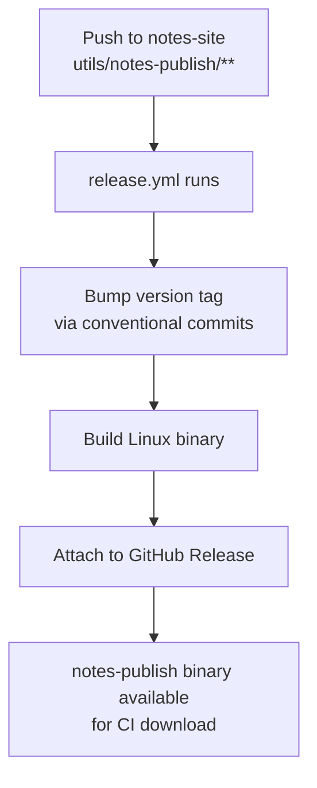

# PKM

A private Zettelkasten + PARA knowledge base that publishes selected notes to a public static site via an automated CI/CD pipeline.

## Architecture



Four repos:

| Repo            | Visibility | Purpose                           |
| --------------- | ---------- | --------------------------------- |
| `pkm`           | public     | Workspace wrapper, Makefile, docs |
| `notes-vault`   | private    | Obsidian vault, never exposed     |
| `notes-staging` | private    | Filtered public notes, PR gate    |
| `notes-site`    | public     | Quartz framework, no .md files    |

The pipeline is opt-in — only notes tagged `public` in their frontmatter are ever published:

```yaml
---
tags:
  - public
---
```

`notes-staging` is the last line of defense. Notes only reach the public site after you review and merge the PR.

## Pipeline Flow



## Vault Example Structure

```
notes-vault/
├── 0_inbox/         ← capture everything here first
├── 1_projects/      ← active work with a deadline
├── 2_areas/         ← ongoing responsibilities
├── 3_resources/     ← reference material
├── 4_archive/       ← completed or inactive
├── 5_slipbox/       ← Zettelkasten permanent notes and general MOCs
├── attachments/    ← images and files
└── templates/      ← Obsidian templates
```

## Prerequisites

- [Rust](https://rustup.rs)
- [Node.js](https://nodejs.org) (v22+)
- [GitHub CLI](https://cli.github.com) — authenticated via `gh auth login`
- A [Cloudflare](https://cloudflare.com) account

## Setup

### 1. Fork or clone the repos

Create four repos on GitHub:

| Repo            | Template                                                     |
| --------------- | ------------------------------------------------------------ |
| `pkm`           | fork this repo                                               |
| `notes-vault`   | empty private repo                                           |
| `notes-staging` | empty private repo                                           |
| `notes-site`    | fork [jackyzha0/quartz](https://github.com/jackyzha0/quartz) |

Then clone with submodules:

```bash
git clone --recurse-submodules git@github.com:<you>/pkm.git
cd pkm
```

### 2. Wire up submodules

```bash
git submodule add git@github.com:<you>/notes-vault.git notes-vault
git submodule add git@github.com:<you>/notes-staging.git notes-staging
git submodule add git@github.com:<you>/notes-site.git notes-site
git commit -m "chore: add submodules"
git push
```

Add `notes-staging` as the content submodule in `notes-site`:

```bash
cd notes-site
git submodule add git@github.com:<you>/notes-staging.git content
git commit -m "chore: add content submodule"
git push
cd ..
```

### 3. Run setup

```bash
make setup
```

This will prompt you for three tokens and configure all GitHub secrets, variables, and the Cloudflare Pages project automatically.

The three tokens you need to create manually:

**STAGING_PAT** — [create here](https://github.com/settings/personal-access-tokens/new)

- Repository access: `notes-staging` only
- Permissions: Contents (read/write), Pull requests (read/write)

**NOTES_SITE_PAT** — [create here](https://github.com/settings/personal-access-tokens/new)

- Repository access: `notes-site` only
- Permissions: Contents (read/write), Actions (read/write)

**CLOUDFLARE_API_TOKEN** — [create here](https://dash.cloudflare.com/profile/api-tokens)

- Use custom token
- Permissions: Cloudflare Pages (edit), Account Settings (read)

### 4. Build the binary

```bash
make install
```

### 5. Verify

```bash
make preview
```

Should show nothing to publish on a fresh vault.

## Daily Usage

| Command        | What it does                                     |
| -------------- | ------------------------------------------------ |
| `make preview` | Dry run — shows what would be published          |
| `make deploy`  | Runs pipeline, opens PR in notes-staging         |
| `make serve`   | Serves Quartz site locally for theme development |
| `make pull`    | Pulls latest on all submodules                   |

## How Publishing Works

`notes-publish` is a Rust binary that:

1. Walks the vault, skipping `attachments/`, `templates/`, and `.obsidian/`
2. For each `.md` file — hashes contents and scans frontmatter for `public` tag in a single pass
3. Diffs against `.checksums.json` manifest in `notes-staging`
4. Produces a plan across five states:

| State            | Has `public`? | Action                        |
| ---------------- | ------------- | ----------------------------- |
| New              | yes           | Copy + add to manifest        |
| New              | no            | Skip                          |
| Known, changed   | yes           | Re-copy + update manifest     |
| Known, changed   | no            | Delete + remove from manifest |
| Known, unchanged | —             | Skip                          |

5. Opens or updates a PR in `notes-staging` with a summary of changes

### Note State Machine



### Attachment State Machine



## CI/CD

Three workflows:

**`notes-vault` — publish.yml**
Triggers on push to main. Downloads `notes-publish` binary from `notes-site` releases, runs it, opens PR in `notes-staging`.

**`notes-staging` — dispatch.yml**
Triggers on push to main (i.e. PR merge). Sends `repository_dispatch` to `notes-site` to trigger a deploy.

**`notes-site` — deploy.yml**
Triggers on `repository_dispatch`. Updates content submodule to latest `notes-staging`, builds Quartz, deploys to Cloudflare Pages via Wrangler.

**`notes-site` — release.yml**
Triggers when `utils/notes-publish/**` changes. Auto-versions using conventional commits and publishes the compiled binary as a GitHub release asset.



## notes-publish

Source lives at `notes-site/utils/notes-publish/`. Written in Rust.

```
src/
├── main.rs        ← CLI, pipeline orchestration
├── vault/         ← walk + scan
├── manifest/      ← .checksums.json read/write
├── plan/          ← diff logic, state machine
├── summary/       ← PR body rendering
└── github/        ← branch, commit, PR via GitHub API
```

To build locally:

```bash
make install
```

To release a new version, use conventional commits when pushing to `notes-site`:

```
feat: add new feature       → minor bump
fix: fix a bug              → patch bump
feat!: breaking change      → major bump
```
